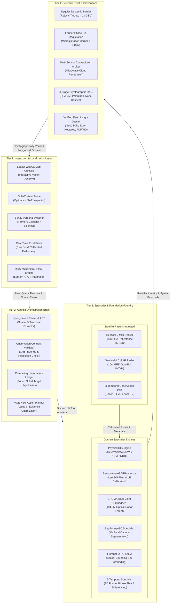
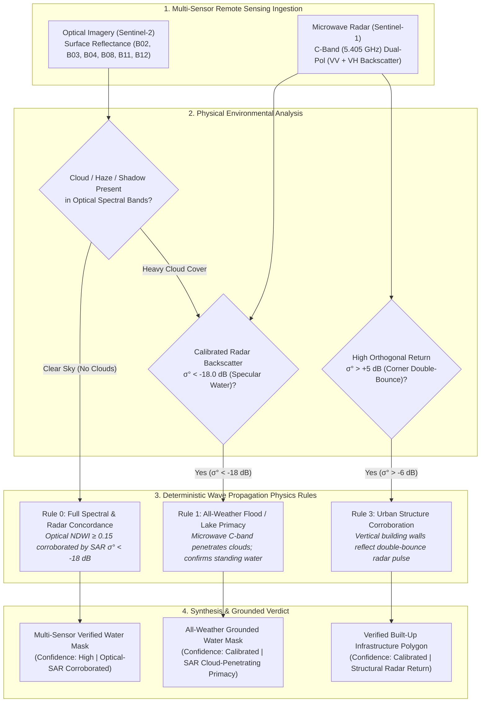

# SatQuery AI — System Architecture & Scientific Dataflow
## Technical Specification | SIH 2026 Problem Statement 26167 (ISRO / SAC)
**Team:** STARFORGE  

---

## 1. High-Level Architectural Philosophy

SatQuery AI is engineered on the principle of **Decoupled Perception and Physics**:
1. **Perception Components (Neural VLMs / Transformers):**
   - Interpret natural language questions and extract query intents.
   - Propose candidate bounding boxes, semantic classes, and visual attention maps.
   - Strictly bounded: When 0 targets match a prompt, neural models must emit `UNRESOLVED_GROUNDING`. They are never allowed to hallucinate coordinates or guess radiometric quantities.
2. **Physics Components (Deterministic GIS Engines):**
   - Calculate exact physical metrics from calibrated sensor pixels: NDWI, NDVI, NDBI, and SAR $\sigma^0\text{ dB}$.
   - Apply geometric affine transformations to compute authoritative geodesic hectares and acres.
   - Evaluate physical barriers (Nyquist spatial resolution, 2D phase co-registration offset).
   - Arbitrate cross-sensor contradictions based on physical wave propagation (e.g. microwave cloud penetration vs optical scattering).

---

## 2. Four-Tier Architectural Topology

---

## 3. The 8-Stage Cryptographic Evidence Graph (DAG)

Every investigation generates an immutable directed acyclic graph where each node contains the SHA-256 cryptographic digest of its inputs and state:

```mermaid
flowchart TD
    subgraph DAG ["8-Stage Immutable Cryptographic Evidence Graph (DAG)"]
        N1["<b>Node 1: User Query & Intent AST</b><br/><code>hash = SHA-256(raw_query, persona, locale)</code>"]
        N2["<b>Node 2: Competing Hypotheses Formulation</b><br/><code>hash = SHA-256(parent_hash, H0_null, H1_target)</code>"]
        N3["<b>Node 3: Satellite Asset Registration</b><br/><code>hash = SHA-256(parent_hash, raster_sha256, crs, gsd)</code>"]
        N4["<b>Node 4: Specialist Parameter Ingestion</b><br/><code>hash = SHA-256(parent_hash, tools, band_indices, thresholds)</code>"]
        N5["<b>Node 5: Empirical Radiometric Computation</b><br/><code>hash = SHA-256(parent_hash, calibrated_pixel_arrays, mask)</code>"]
        N6["<b>Node 6: Cross-Sensor Contradiction Arbitration</b><br/><code>hash = SHA-256(parent_hash, optical_sar_agreement, physics_rule)</code>"]
        N7["<b>Node 7: Evidence Sufficiency Verification</b><br/><code>hash = SHA-256(parent_hash, nyquist_passed, coreg_passed)</code>"]
        N8["<b>Node 8: Final Grounded Finding & Vector Export</b><br/><code>hash = SHA-256(parent_hash, polygons, hectares, confidence)</code>"]

        N1 -->|"Prior State"| N2
        N2 -->|"Asset Binding"| N3
        N3 -->|"Parameter Binding"| N4
        N4 -->|"Pixel Ingestion"| N5
        N5 -->|"Sensor Cross-Check"| N6
        N6 -->|"Barrier Validation"| N7
        N7 -->|"Cryptographic Seal"| N8
    end
```

### Integrity Guarantee:
If any downstream parameter or finding is altered, the cryptographic chain hash is invalidated. This enables automated auditability for ISRO mission archives.

---

## 4. Multi-Sensor Grounding & Cross-Modal Arbitration Flow

When optical and microwave sensors evaluate the same geographic scene under non-ideal weather conditions, SatQuery AI resolves contradictions through physical wave mechanics rather than statistical guessing:

---

## 5. Public API Interface

The system exposes a clean REST API compliant with OpenAPI 3.1:
- `POST /api/frontier/investigate-geotiff`: Executes real-time physical investigation on uploaded or cataloged GeoTIFFs.
- `GET /api/demo-corpus/manifest`: Returns authoritative metadata for the 20 real Earth Observation scenes.
- `GET /api/frontier/reports/{id}`: Downloads verified cryptographic JSON/Markdown audit dossiers.

*Full specification available at:* [`api/sanitized_openapi.json`](api/sanitized_openapi.json).
