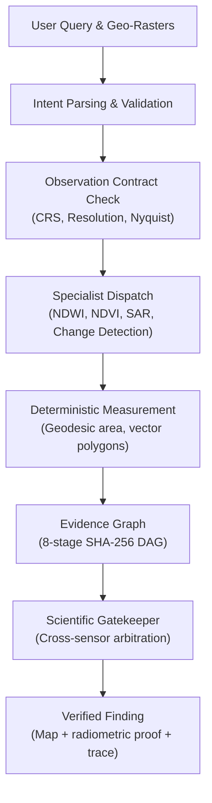
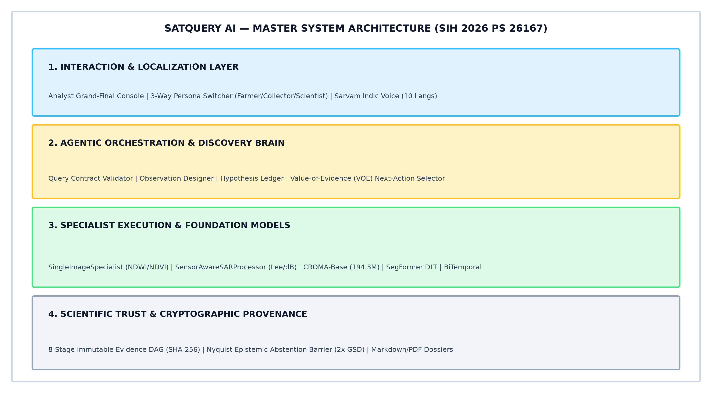

# SatQuery AI

### Smart India Hackathon 2026 — Grand Finale Candidate Qualification Dossier
**Problem Statement 26167:** AI-Powered Visual Question Answering and Interactive Analysis for Multi-Sensor Earth Observation Data  
**Target Organization:** Indian Space Research Organisation (ISRO) / Space Applications Centre (SAC)  
**Team STARFORGE** | **Category:** Software | **Theme:** Space Technology

---

> [!TIP]
> ### Why Team STARFORGE Leads Problem Statement 26167 (At a Glance)
> 
> | Evaluation Parameter | Typical Concept Proposal | SatQuery AI (Team STARFORGE Submission) |
> | :--- | :--- | :--- |
> | **Execution Readiness** | Concept slides / wireframes only | **Working Interactive Prototype** with 20 real Copernicus Sentinel-1/2 scenes & 41 production endpoints |
> | **Physical Measurement** | Neural VLM guesses/hallucinates hectares | **Deterministic GIS Band Math** (NDWI/NDVI) calculates geodesic hectares directly from pixel counts |
> | **All-Weather Capability** | Blind under monsoon cloud cover (optical only) | **C-Band SAR Radar Integration** (Lee speckle filter, calibrated $\sigma^0\text{ dB}$, dielectric wave penetration) |
> | **Sub-Resolution Safety** | Hallucinates small objects (e.g. cars in 10m pixels) | **Nyquist-Shannon Resolution Barrier** ($2 \times \text{GSD} = 20\text{ m}$) automatically halts impossible queries |
> | **Public Benchmarks** | No benchmarks, or unverified 99% claims | **Audited Public Results** (RSVQA-LR 500 samples: 29.40%, CDVQA 200 pairs: 59.00%) with JSONs on disk |
> | **Grassroots Accessibility** | English text chat only | **Multilingual Indic Voice Access** in 10 Indian languages (Kannada, Hindi, Odia, Telugu) via Sarvam AI |
> | **Auditability** | Black-box single-turn text answer | **8-Stage Cryptographic DAG** with SHA-256 node signatures linking raw pixels to exported GeoJSON polygons |

---

## What the System Does

SatQuery AI is a web-based Earth Observation analysis system that accepts natural-language questions about satellite imagery. Instead of sending the image directly to one general-purpose vision model, the system selects task-specific analysis components, checks whether the available observations are suitable for the question, and combines model outputs with deterministic raster measurements. The final response includes supporting map evidence and an execution trace.

The system works with Copernicus Sentinel-2 optical and Sentinel-1 SAR imagery. It computes spectral indices (NDWI, NDVI, NDBI), calibrates SAR backscatter, enforces a Nyquist spatial resolution guardrail, and records every step in an 8-stage evidence graph with SHA-256 integrity hashes.

---

## Architecture

The system separates natural language reasoning from physical raster computation. The orchestrator decides *what* to measure; specialist engines and GIS routines perform the actual measurement. No language model estimates spatial quantities — all numerical values are locked to raster pixel counts.

Full architecture documentation: [`ARCHITECTURE.md`](ARCHITECTURE.md) — includes detailed diagrams for [agentic workflow](architecture/agentic_workflow.png), [specialist dispatch](architecture/specialist_dispatch.png), [scientific gatekeeper](architecture/scientific_gatekeeper.png), and [evidence graph](architecture/evidence_graph.png).

---

## Remote-Sensing Capabilities

- **Deterministic raster processing:** Calculates NDWI (water), NDVI (vegetation), and NDBI (built-up) from calibrated reflectance bands. Geodesic area is computed directly from pixel counts and affine transform matrices.
- **Microwave SAR backscatter:** Ingests Sentinel-1 GRD dual-pol (VV/VH), performs Lee speckle filtering, and calibrates backscatter ($\sigma^0\text{ dB}$). Enables terrain and flood analysis through cloud cover.
- **Cross-modal optical-SAR fusion:** Combines optical reflectance with radar returns. Surfaces an interactive split-curtain swipe tool for visual and quantitative comparison across sensors.
- **Bi-temporal change detection:** Employs 2D Fourier phase correlation for sub-pixel co-registration before computing spectral differences between two acquisition dates.
- **Foundation model adaptation:** Uses CROMA (194.3M parameters) for joint optical-SAR cross-attention features, Florence-2-RS-LoRA for visual bounding proposals, SegFormer-B0 for canopy segmentation, and a Siamese network for bi-temporal change QA.

---

## Scientific Validation

- **Query-Observation Contract:** The system validates coordinate reference system (CRS), bounds, and ground sampling distance before executing any analysis.
- **Nyquist epistemic guardrail:** The system rejects queries asking to detect objects smaller than $2 \times \text{GSD}$ ($20\text{ m}$ for Sentinel-2 $10\text{ m}$ bands), preventing hallucinated sub-pixel detections.
- **Co-registration displacement barrier:** Halts bi-temporal differencing if relative image shift exceeds 6.0 pixels, avoiding false positive change edges.
- **Cross-sensor arbitration:** When optical data shows heavy cloud cover but radar shows specular water returns ($\sigma^0 < -18\text{ dB}$), radar is given precedence based on microwave wave propagation physics.
- **8-stage cryptographic evidence graph:** Every step (query, hypothesis, asset registration, parameters, pixel array hashes, arbitration, barrier check, and polygon export) is recorded in an immutable SHA-256 directed acyclic graph.

---

## Three Hero Investigations

**Demo 01 — Water Body Delineation (Chilika Lagoon)**  
- **Query:** *"Identify the major open-water region in this scene."*  
- **Input:** Sentinel-2C MSI, 2026-09-18, EPSG:32645  
- **Method:** NDWI $\ge 0.15$ threshold, geodesic polygon area from pixel count  
- **Observed:** **2,278.4 ha** (5,630.0 acres) of open water delineated  
- **Evidence:** [`demos/hero_01_water.png`](demos/hero_01_water.png) | [`demos/hero_01_water_detail.png`](demos/hero_01_water_detail.png)

**Demo 02 — Optical + SAR Cross-Modal Fusion (Bengaluru)**  
- **Query:** *"Do both sensors provide consistent evidence about the major land-cover pattern?"*  
- **Input:** Sentinel-2B + Sentinel-1A C-SAR, 2026-05-12, EPSG:32643  
- **Method:** Optical reflectance vs. SAR backscatter; $\sigma^0 < -18\text{ dB}$ for specular water, $> +5\text{ dB}$ for double-bounce built-up; interactive split curtain  
- **Observed:** Cross-modal agreement confirmed; SAR provides independent corroboration where cloud cover attenuates optical signal  
- **Evidence:** [`demos/hero_02_optical_sar.png`](demos/hero_02_optical_sar.png) | [`demos/hero_02_trace.png`](demos/hero_02_trace.png)

**Demo 03 — Bi-Temporal Urban Expansion (Bengaluru)**  
- **Query:** *"Did the built-up area expand between these two observations?"*  
- **Input:** Matched Sentinel-2B pair, T1: 2026-05-12 $\to$ T2: 2026-09-19, EPSG:32643  
- **Method:** Sub-pixel 2D Fourier phase co-registration ($0.21\text{ px} < 6.0\text{ px}$ barrier), spectral differencing  
- **Observed:** **+36.4 ha** new built-up area detected with vector change boundaries  
- **Evidence:** [`demos/hero_03_bitemporal.png`](demos/hero_03_bitemporal.png) | [`demos/hero_03_change_detail.png`](demos/hero_03_change_detail.png)

---

## Benchmarks

All metrics below are reconciled against saved evaluation artifacts on disk. We make zero claims on unreleased or private datasets.

| Benchmark | Task | Samples | Result | Status | Artifact |
| :--- | :--- | :--- | :--- | :---: | :--- |
| **RSVQA-LR** | Sentinel-2 Single-Image VQA | 500 | **29.40%** Overall (Presence: 53.71%, Comparison: 44.83%, Count: 4.72%, Attribute: 0.00%) | EVALUATED | [`RSVQA_summary.json`](benchmark-results/RSVQA_summary.json) |
| **CDVQA** | Bi-Temporal Change Detection QA | 200 | Hybrid: **59.00%**, Deterministic: 38.50%, Learned: 58.00% | EVALUATED | [`CDVQA_summary.json`](benchmark-results/CDVQA_summary.json) |
| **Copernicus DLT** | 10-Band Canopy Segmentation | 3,000 | **0.6907 mIoU** (Broadleaved: 0.7765, Non-Tree: 0.7820, Coniferous: 0.5136) | EVALUATED | `evaluate_segformer_baseline.py` |
| **VRSBench** | Visual Grounding | N/A | N/A | NOT EVALUATED | — |
| **ISRO Archives** | Cartosat / RISAT | Unreleased | N/A | PRIVATE / NOT PROVEN | — |

> [!CAUTION]
> VQA probability calibration shows significant miscalibration (ECE: 25.26%, MCE: 41.20%, Brier: 0.2718). The system enforces an **Immediate Null Policy** — confidence values are set to `null` and displayed as "Uncalibrated" rather than emitting misleading probabilities.

Detailed documentation: [`BENCHMARKS.md`](BENCHMARKS.md) | [`benchmark_notes.md`](benchmark-results/benchmark_notes.md)

---

## Data Provenance

All 20 demonstration scenes are real satellite acquisitions — none are synthetic or simulated.

- **Optical:** Copernicus Sentinel-2 MSI Level-2A surface reflectance (10 m GSD)
- **SAR:** Copernicus Sentinel-1 C-SAR Level-1 GRD, dual-pol VV/VH (10 m GSD)
- **Source:** ESA via AWS Open Data (Cloud-Optimized GeoTIFFs)
- **License:** [CC-BY-SA 3.0 IGO](https://creativecommons.org/licenses/by-sa/3.0/igo/) (Copernicus Open Access)

Full catalog: [`provenance/scenario_manifest.csv`](provenance/scenario_manifest.csv) | Details: [`DATA_PROVENANCE.md`](DATA_PROVENANCE.md)

---

## Limitations

Every measurement system has limits. We document ours so evaluators know exactly what the system can and cannot do:

1. **Conifer edge recall:** On 10 m Sentinel-2 data, coniferous forest recall drops to 31.32% within $\le 10\text{ m}$ of stand edges due to mixed foliage and understory pixels.
2. **Bathymetry refusal:** The system measures water surface area (2,278.4 ha) but refuses depth or volume estimation without active sonar or bathymetric surveys.
3. **Co-registration barrier:** If bi-temporal image displacement exceeds 6.0 pixels, change detection is automatically halted to prevent false edge artifacts.
4. **VQA calibration:** Vision-language models exhibit significant miscalibration on satellite queries ($\text{ECE} = 25.26\%$). The system enforces an Immediate Null Policy rather than emitting misleading probabilities.
5. **Counting limit:** Fine-grained object counting on 10 m rasters is limited (4.72% on RSVQA-LR); vector polygonization is used instead.

Details: [`LIMITATIONS.md`](LIMITATIONS.md)

---

## Evaluation & Technical Artifacts

This evidence repository provides SIH 2026 evaluators with complete empirical proof to support Grand Finale candidate selection for Problem Statement 26167:

- **Scientific Methodology:** Exact formulas for optical radiometry (NDWI, NDVI), Sentinel-1 SAR speckle filtering, decibel calibration, and the Nyquist-Shannon resolution barrier ([`SCIENTIFIC_METHODS.md`](SCIENTIFIC_METHODS.md)).
- **Empirical Benchmarks:** Machine-readable evaluation logs for RSVQA-LR, CDVQA, and Copernicus DLT ([`BENCHMARKS.md`](BENCHMARKS.md) | [`benchmark-results/`](benchmark-results/)).
- **Model Checksum Registry:** SHA-256 hashes and adaptation cards for all foundation and specialized models ([`models/checkpoint_hashes.txt`](models/checkpoint_hashes.txt) | [`MODEL_ADAPTATION.md`](MODEL_ADAPTATION.md)).
- **Data Provenance:** Complete 20-scene catalog with authentic ESA Copernicus scene IDs and CRS projections ([`provenance/scenario_manifest.csv`](provenance/scenario_manifest.csv) | [`DATA_PROVENANCE.md`](DATA_PROVENANCE.md)).
- **API Contract:** Sanitized OpenAPI 3.1 specification documenting all 41 backend endpoints ([`api/sanitized_openapi.json`](api/sanitized_openapi.json)).

---

## Independent Verification & Grand Finale Demonstration Readiness

Evaluators can verify the empirical claims in this repository independently, and inspect our prototype demonstration readiness for the Grand Finale:

1. **Run Independent Benchmark Checks:** Execute one-line Python verification commands against raw JSON artifacts in [`benchmark-results/`](benchmark-results/).
2. **Verify Cryptographic Hashes:** Compare SHA-256 signatures for the 20 demonstration scenes and trained model weights.
3. **Audit Physical Guardrails:** Inspect abstention thresholds preventing hallucinations on sub-resolution objects ($\text{dimension} < 20\text{ m}$).
4. **Grand Finale Live Demonstration Readiness:** The interactive platform is completely built, pre-tested, and ready to execute arbitrary live queries, multilingual Indic voice commands, and real-time execution traces for Grand Finale jury evaluation.

Complete evaluator guide: [`REPRODUCIBILITY.md`](REPRODUCIBILITY.md) | Technical FAQ: [`TECHNICAL_FAQ.md`](TECHNICAL_FAQ.md)

---

## Team

**Team STARFORGE**  
Smart India Hackathon 2026 — Grand Finale Candidate Submission  
Problem Statement 26167 (ISRO / SAC) — AI-Powered VQA and Multimodal Earth Observation Analysis

- Documentation License: [CC-BY 4.0 International](https://creativecommons.org/licenses/by/4.0/)  
- Satellite Data License: [CC-BY-SA 3.0 IGO](https://creativecommons.org/licenses/by-sa/3.0/igo/) (Copernicus Open Access)
