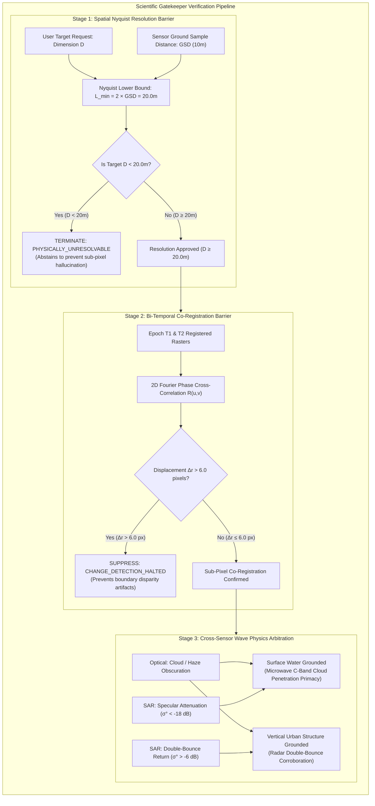

# SatQuery AI — Scientific Methods & Physical Formulations
## Mathematical Rigor | SIH 2026 Problem Statement 26167 (ISRO / SAC)
**Team:** STARFORGE  

---

## 1. Deterministic Spectral Indices (Optical MSI)

All spectral indices are calculated directly from 16-bit Digital Numbers (DN) converted to Bottom-of-Atmosphere (BOA) surface reflectance $\rho$:

### 1.1 Normalized Difference Water Index (NDWI)
Delineates open water bodies and wetlands (McFeeters, 1996):
$$\text{NDWI} = \frac{\rho_{\text{Green}} - \rho_{\text{NIR}}}{\rho_{\text{Green}} + \rho_{\text{NIR}}} = \frac{\text{B03} - \text{B08}}{\text{B03} + \text{B08}}$$
- **Decision Threshold:** Pixels with $\text{NDWI} \ge +0.15$ are classified as open surface water.

### 1.2 Normalized Difference Vegetation Index (NDVI)
Quantifies photosynthetic biomass and crop vigor (Rouse et al., 1974):
$$\text{NDVI} = \frac{\rho_{\text{NIR}} - \rho_{\text{Red}}}{\rho_{\text{NIR}} + \rho_{\text{Red}}} = \frac{\text{B08} - \text{B04}}{\text{B08} + \text{B04}}$$

### 1.3 Normalized Difference Built-Up Index (NDBI)
Identifies impervious surfaces and urban infrastructure (Zha et al., 2003):
$$\text{NDBI} = \frac{\rho_{\text{SWIR}} - \rho_{\text{NIR}}}{\rho_{\text{SWIR}} + \rho_{\text{NIR}}} = \frac{\text{B11} - \text{B08}}{\text{B11} + \text{B08}}$$

---

## 2. Synthetic Aperture Radar (SAR) Microwave Processing

### 2.1 Radiometric Calibration to Backscatter Decibels ($\sigma^0\text{ dB}$)
Calibrates Sentinel-1 Level-1 Ground Range Detected (GRD) intensity values:
$$\sigma^0 (\text{dB}) = 10 \cdot \log_{10}(\text{DN}^2) - K_{\text{calib}}$$
Where $K_{\text{calib}} = 83.0\text{ dB}$ is the standard calibration constant for Sentinel-1 GRD.

### 2.2 Lee Adaptive Speckle Filtering
Reduces multiplicative speckle noise while preserving sharp linear features (shorelines, roads, field boundaries):
$$\hat{R} = \bar{I} + W \cdot (I - \bar{I})$$
Where the adaptive weight $W$ is derived from local window mean $\bar{I}$ and variance $\sigma_I^2$:
$$W = \frac{\sigma_I^2 - \sigma_N^2}{\sigma_I^2} = \frac{\text{Var}(I) - \bar{I}^2 \cdot \sigma_v^2}{\text{Var}(I)}$$
Executed over a $5 \times 5$ moving kernel.

### 2.3 Dielectric Water Attenuation
Calm surface water acts as a specular reflector for C-band microwaves (wavelength $\lambda \approx 5.6\text{ cm}$), reflecting pulses away from the antenna:
$$\text{Water Confirmation Condition:} \quad \sigma_{\text{VV}}^0 < -18.0\text{ dB}$$

---

## 3. Spatial Resolution & Nyquist-Shannon Sampling Guardrail

To eliminate hallucination of sub-pixel features, SatQuery AI implements an automated **Nyquist Epistemic Barrier**:
- Let $\text{GSD}$ be the Ground Sample Distance of the imaging sensor ($10.0\text{ m}$ for Sentinel-2 optical bands).
- By the Nyquist-Shannon sampling theorem, reliable feature resolution requires a spatial extent of at least 2 samples:
$$L_{\text{min}} = 2 \times \text{GSD} = 20.0\text{ meters}$$
- **Automated Abstention Rule:** If a user query demands identification of an object with known physical dimension $D < L_{\text{min}}$ (e.g. an excavator or automobile measuring $3.5\text{ m}$), the system terminates the pipeline with status:
$$\textbf{PHYSICALLY\_UNRESOLVABLE}$$
This explicitly prevents false-positive claims common in generic multimodal LLMs.

---

## 4. Bi-Temporal Co-Registration Barrier

Before evaluating multi-temporal change, SatQuery AI validates spatial alignment using 2D phase cross-correlation:
$$R(u, v) = \frac{\mathcal{F}^{-1} \{ G_1(f_x, f_y) \cdot G_2^*(f_x, f_y) \}}{\| \mathcal{F}^{-1} \{ G_1(f_x, f_y) \cdot G_2^*(f_x, f_y) \} \|}$$
- Where $(u, v)$ is the estimated sub-pixel translation vector between acquisitions.
- **Physical Barrier:** If the displacement offset exceeds the calibrated tolerance ($\Delta r = \sqrt{u^2 + v^2} > 6.0\text{ pixels}$), change detection is automatically suppressed to prevent false boundary disparity artifacts.

---

## 5. Five-Point Cross-Sensor Contradiction Arbitration

When optical and SAR sensors disagree, SatQuery AI resolves the discordance using wave propagation physics:
1. **Cloud Penetration:** Optical high reflectance + SAR low backscatter ($< -18\text{ dB}$) $\to$ Surface water under clouds (SAR primacy).
2. **Dielectric Soil Moisture:** Optical dry soil + SAR elevated backscatter $\to$ Subsurface moisture or waterlogged soil.
3. **Corner Reflection (Double-Bounce):** Optical dark shadow + SAR extreme high backscatter ($> +5\text{ dB}$) $\to$ Urban vertical structures or towers.
4. **Specular Wind Roughness:** Optical calm water + SAR high backscatter $\to$ Wind-induced wave roughening (SAR caveat logged).
5. **Solar Zenith Geometry:** Deep shadow in optical $\to$ SAR radar illumination independent of sun angle.

---

## 6. Scientific Gatekeeper Verification Pipeline

The entire physical verification flow is summarized in this deterministic decision graph:

