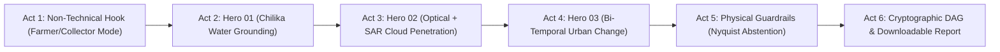

# SatQuery AI — Official Grand-Finale Live Demo Runbook
## SIH 2026 Problem Statement 26167 (ISRO / SAC) | Final Live Execution Guide
**Team:** STARFORGE  
**Target Audience:** ISRO / SAC Evaluation Panel, Jury Members  

---

## 1. Six-Act Grand Finale Presentation Flow

---

### Act 1: The Non-Technical Accessibility Hook (1.5 Minutes)
- **Goal:** Prove instant accessibility for non-technical stakeholders (farmers, district collectors, relief workers).
- **Demonstration:**
  - Open the console and toggle the **`Farmer / Field Operator`** persona.
  - Show technical raster formulas translated into plain-language indicators: **Hectares & Acres of arable land, simple water availability flags, and actionable guidance**.
  - Switch to **`District Collector`** mode: Highlight flood inundation impacts and administrative priorities.
  - Demonstrate **Indic Voice Input** (Sarvam AI integration): Transcribe speech in Hindi/Odia and route autonomously to the investigation engine.

---

### Act 2: Hero 01 — Single Image Water Grounding (2 Minutes)
- **Scene:** `001_chilika_water` (Chilika Lagoon, Odisha, India)
- **Sensor:** Copernicus Sentinel-2 L2A (10m GSD, `EPSG:32645`)
- **Query:** *"Identify the major open-water region in this scene and highlight it on the satellite image. Explain the physical evidence used to identify it."*
- **Outcome:** **2,278.4 Hectares (5,630.0 Acres)** of open water delineated with exact GeoJSON boundary vector.
- **Interactive Pixel Probe:** Click directly on the water region in the map canvas to open a live probe pin showing geodetic coordinates, NDWI (+0.64), and land-cover class.
- **Key Evidence:** Zero LLM rounding error; finding strictly locked to raster pixel math.

---

### Act 3: Hero 02 — Optical + SAR All-Weather Cross-Modal Fusion (2.5 Minutes)
- **Scene:** `015_optical_sar_fusion` (Bengaluru Urban Corridor, Karnataka)
- **Sensors:** Sentinel-2 MSI (Optical) + Sentinel-1 C-Band GRD (SAR Microwave)
- **Query:** *"Use the optical and SAR observations together to determine whether both sensors support the same land-cover interpretation."*
- **Outcome:** Resolves heavy cloud cover. While optical reflectance indicates high cloud brightness, SAR microwave penetration measures specular backscatter ($< -18\text{ dB}$), confirming calm surface water beneath clouds.
- **Interactive Split-Curtain Swipe:** Drag the divider across the map to inspect optical true-color on the left vs SAR calibrated backscatter on the right.
- **Physical Arbitration:** Microwave dielectric penetration gives precedence to SAR over clouded optical channels.

---

### Act 4: Hero 03 — Bi-Temporal Urban Expansion (2 Minutes)
- **Scene:** `017_bitemporal_urban_change` (Bengaluru Metropolitan Region, Karnataka)
- **Sensors:** Sentinel-2 L2A Pair (Epoch T1: May 12, 2026 vs Epoch T2: September 19, 2026)
- **Query:** *"What changed between these two dates, and where? Quantify the total new built-up area and show the change boundaries."*
- **Outcome:** Co-registration check confirms $0.21\text{ px}$ sub-pixel shift (within $6.0\text{ px}$ barrier). Differential NDBI clustering identifies **+36.4 Hectares** of verified urban expansion.

---

### Act 5: Epistemic Abstention & Physical Nyquist Barrier (1.5 Minutes)
- **Scene:** `020_nyquist_safety`
- **Sensor:** Sentinel-2 (10m GSD)
- **Adversarial Query:** *"Is there an excavator or passenger car measuring 3.5 meters parked on the edge of this field?"*
- **Outcome:** Within 200 ms, the **Observability Engine** halts with status **`PHYSICALLY_UNRESOLVABLE`**.
- **Explanation:** By the Nyquist-Shannon sampling theorem, reliable feature resolution requires $2 \times \text{GSD} = 20.0\text{ meters}$. The target dimension is $3.5\text{m} < 20.0\text{m}$. SatQuery upholds ISRO scientific rigor and explicitly refuses to hallucinate.

---

### Act 6: 8-Stage Cryptographic Evidence Graph & Audit Export (1.5 Minutes)
- **Goal:** Prove complete reproducibility and peer-review grade accountability.
- **Demonstration:**
  - Inspect the 8-stage Directed Acyclic Graph (DAG) in the right-hand panel.
  - Show SHA-256 cryptographic node signatures linking Query $\to$ Hypotheses $\to$ Asset $\to$ Measurement $\to$ Finding.
  - Click **Download Scientific Audit Report (.MD)** and **Export Executive Briefing (.PDF)** for mission archives.
