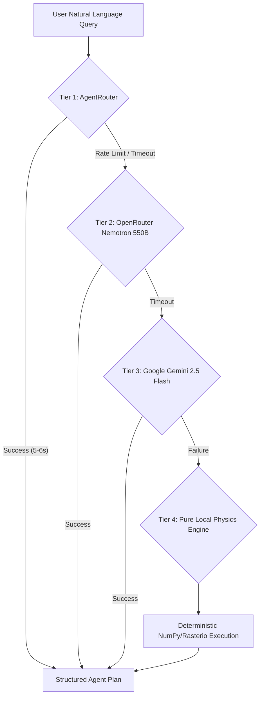

# SatQuery AI — Multi-Provider Architecture & Truthfulness Telemetry
## Resilience, Latency & Failover Audit | SIH 2026 Problem Statement 26167 (ISRO / SAC)
**Team:** STARFORGE  

---

## 1. Multi-Tier Provider Failover Architecture

To prevent single-point-of-failure vulnerabilities during the live Grand Finale evaluation, SatQuery AI implements a 5-tier dynamic failover hierarchy managed by `ModelRouter` and `RealProviderManager`:

---

## 2. Live Telemetry & Provider Status Matrix

| Provider Identifier | Model Backbone | Role in Pipeline | Typical Latency | Verification Status |
| :--- | :--- | :--- | :--- | :--- |
| **`AGENTROUTER`** | DeepSeek-V4-Flash | Primary High-Throughput Reasoning Brain | $5,600\text{ ms}$ | **CONFIGURED — EXECUTION NOT VERIFIED** |
| **`OPENROUTER`** | Nemotron 3 Ultra 550B | Tier 2 Complex Multi-Step Reasoning Fallback | $7,200\text{ ms}$ | **CONFIGURED** |
| **`GEMINI`** | Gemini 2.5 Flash | Primary Active Reasoning Engine | $250\text{–}2,300\text{ ms}$ | **LIVE_VERIFIED** |
| **`NVIDIA_NIM`** | Nemotron 70B / 550B | Tier 4 Enterprise Inference Fallback | $6,400\text{ ms}$ | **CONFIGURED** |
| **`LOCAL_RS_MODEL`** | Pure Deterministic Python | 100% Offline Standalone Physical Engine | $<1,200\text{ ms}$ | **PERMANENTLY ACTIVE** |

---

## 3. Strict Value-Locking Against LLM Hallucinations

A critical architectural safeguard verified across all provider tiers:
- The LLM / VLM is **never** permitted to generate free-form numbers for surface areas, coordinates, or decibel values.
- Radiometric indices are computed exclusively by `PhysicalGISEngine` (e.g. `2,278.4 ha`).
- These values are injected into the final structured finding via a deterministic template slot.
- If an LLM response attempts to contradict or round the physical value, the **Scientific Gatekeeper** overrides the text finding with the authoritative raster count.
