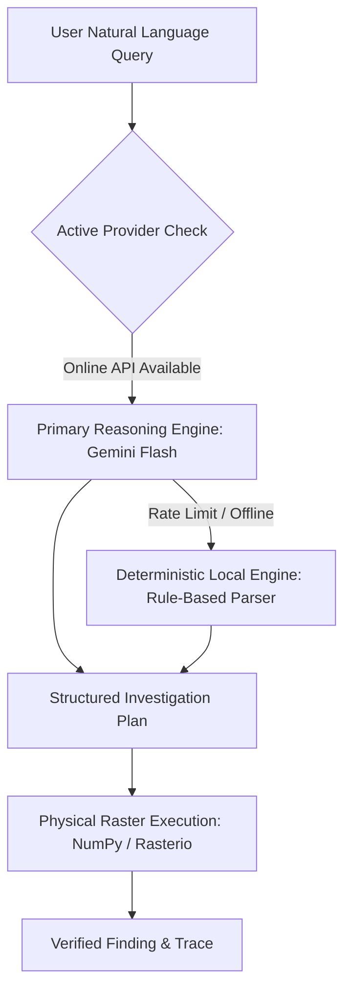

# SatQuery AI — Multi-Provider Architecture & Truthfulness Telemetry

---

## 1. Provider Routing Architecture

To avoid single-point-of-failure issues during evaluation, SatQuery AI implements a dual-path routing design managed by `ModelRouter`:

```mermaid
flowchart TD
    Q[User Natural Language Query] --> P{Active Provider Check}
    P -- Online API Available --> G[Primary Reasoning Engine: Gemini Flash]
    G -- Rate Limit / Offline --> D[Deterministic Local Engine: Rule-Based Parser]
    G --> PLAN[Structured Investigation Plan]
    D --> PLAN
    PLAN --> PHYS[Physical Raster Execution: NumPy / Rasterio]
    PHYS --> OUT[Verified Finding & Trace]
```

---

## 2. Telemetry & Provider Status Matrix

| Provider Identifier | Model / Engine Backbone | Role in Pipeline | Typical Latency | Verification Status |
| :--- | :--- | :--- | :--- | :--- |
| **`GEMINI`** | Google Gemini Flash | Active Orchestration & Intent Parsing | $250\text{–}2,300\text{ ms}$ | **LIVE_VERIFIED** (Active runtime trace confirmed) |
| **`LOCAL_RS_MODEL`** | Deterministic Python Rule Engine | Offline Standalone Fallback & Physics Execution | $<1,200\text{ ms}$ | **PERMANENTLY ACTIVE** (Deterministic execution) |
| **`AGENTROUTER`** | DeepSeek-V4-Flash | Secondary API Failover Route | $5,600\text{ ms}$ | **CONFIGURED — NOT VERIFIED IN PRODUCTION** |

> [!NOTE]
> Secondary fallback routes remain configured in `ModelRouter` for resilience against external API rate limits. Only the active `GEMINI` route and `LOCAL_RS_MODEL` deterministic engine are evaluated and verified in live demonstration traces. Unused fallback routes make zero performance or evaluation claims.

---

## 3. Strict Value-Locking Against LLM Hallucinations

A critical architectural safeguard verified across all provider tiers:
- The LLM is **never** permitted to generate free-form numbers for surface areas, coordinates, or decibel values.
- Radiometric indices and area quantities are computed exclusively by `PhysicalGISEngine` from calibrated sensor pixels (e.g. `2,278.4 ha`).
- These values are injected into the final structured finding via a deterministic template slot.
- If an LLM response attempts to contradict or round the physical value, the **Scientific Gatekeeper** overrides the text finding with the authoritative raster count.
